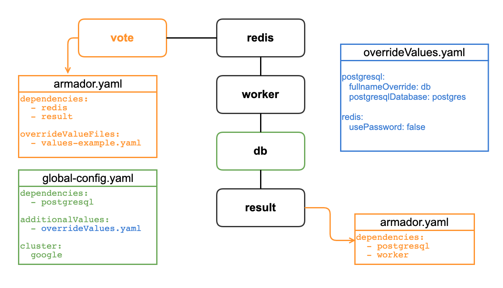

# Example voting app

As mentioned in the [README](../README.md), Armador is comparable to Docker Compose, but for Kubernetes.

This means that Docker's [Example Voting App](https://github.com/dockersamples/example-voting-app), extends nicely to be an example for using Armador. And a special thanks to Codefresh for providing the [Helm charts for the example voting app](https://github.com/codefresh-io/example-voting-app).

## Architecture

This diagram is an annotated version from the original app. https://github.com/dockersamples/example-voting-app#architecture

### Description

* vote: This helm chart [vote](example-app-charts/vote) is configured with an armador.yaml file to define the dependencies. When `armador create name -p vote` is called, the armador.yaml file in this path is what starts building the env.
* redis: This helm chart is defined as a dependency in `vote/armador.yaml`.
* worker: The helm chart is pulled in from Codefresh's github repo (defined as a dependency in `result/armador.yaml`, but only as an example that working on `vote` doesn't directly mean that it needs to know the middle of the architecture).
* db: This is `postgresql` defined as a `prereqChart` in the global config. The idea here is that maybe defining the database is the same across all environments, regardless of the apps installed.
* result: Defined as a dependency in `vote/armador.yaml`. Armador then finds `result/armador.yaml` to be sure that worker & postgres are also installed, building out a full dependency tree before installing anything.

tl;dr: The files to that are needed to make this all work:

* `example-app-charts/vote/armador.yaml`
* `global-config.yaml`
* `overrideValues.yaml`

### Running example

To run this example:

* modify `global-config.yaml` with valid cluster details
* `armador create ex-vote --config example/global-config.yaml -p example/example-app-charts/vote`
