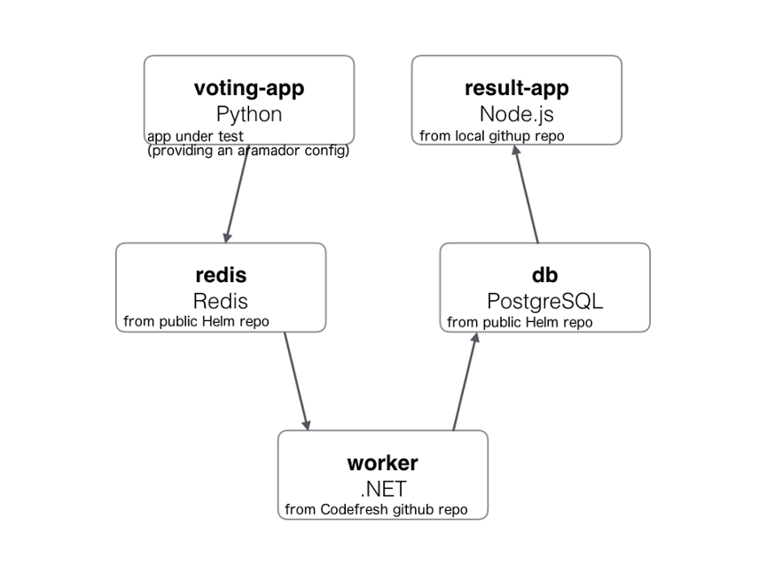

# Example voting app

As mentioned in the [README](../README.md), Armador is comparable to Docker Compose, but for Kubernetes.

This means that Docker's [Example Voting App](https://github.com/dockersamples/example-voting-app), extends nicely to be an example for using Armador. And a special thanks to Codefresh for providing the [Helm charts for the example voting app](https://github.com/codefresh-io/example-voting-app).

## Architecture

This diagram is an annotated version from the original app. https://github.com/dockersamples/example-voting-app#architecture

### Description

* voting-app: This helm chart [vote](example-app-charts/vote) is configured with an armador.yaml file to define the dependencies.
* redis: This helm chart is defined as a dependency in `vote/armador.yaml`.
* worker: Helm chart pulled in from Codefresh's github repo (defined as a dependency in `vote/armador.yaml`).
* db: As below, this is defined as a `prereqChart` in the global config.
* result-app: Defined as a dependency in `vote/armador.yaml`.

tl;dr: The files to that are needed to make this all work:

* `example-app-charts/vote/armador.yaml`
* `global-config.yaml`
* `overrideValues.yaml`

### Running example

To run this example:

* modify `global-config.yaml` with valid cluster details
* `armador create ex-vote --config example/global-config.yaml -p example/example-app-charts/vote`
